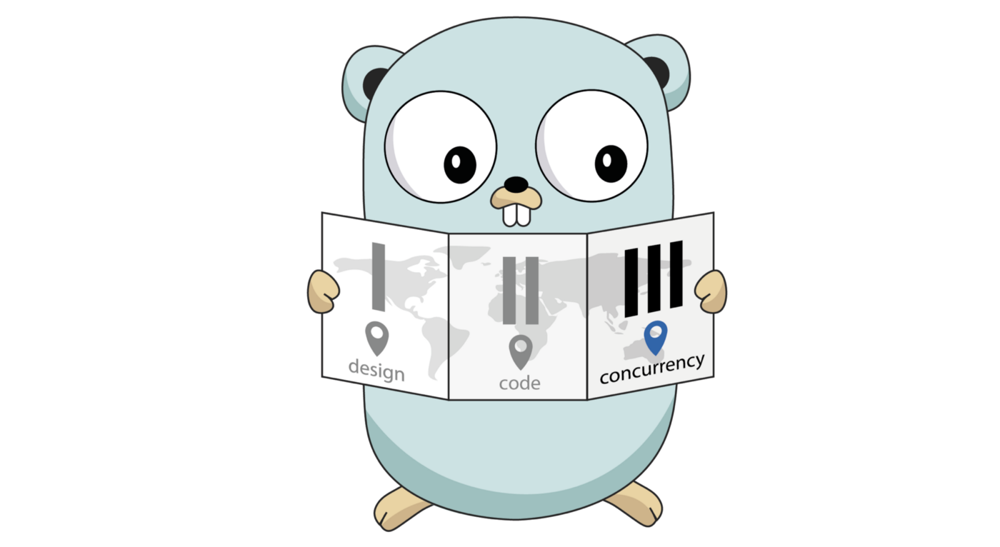

---

  
  
  
  
  
  
  
  
  
  
  

---

## Stack & Skills

  • Go • Golang • Backend • Linux  
  • HTTP • RestApi • Api • Postman  
  • Unittest • testify • JWT • JSON/YAML  
  • SQL • MySQL • SQLite • PostgreSQL  
  • Kafka • RabbitMQ • Redis  
  • Prometheus • Grafana • Jaeger  
  • Docker • Docker Compose • Docker Hub  
  • Git • GitHub • GitHub Actions • CI/CD  

---

## Обо мне

Мой интерес к программированию начался с написания базы данных на Turbo Pascal, прошёл через автоматизацию инженерных расчётов на РЖД, и подтолкнул к созданию с нуля сайта компании. Обширный бэкграунд помог понять, что в большей степени мне интересен именно backend, а Go заинтересовал своей лаконичной упорядоченностью и скоростью.  

Как инженер я в восхищении от высоконагруженных систем, которые работают быстро и без сбоев, поэтому стремлюсь к развитию экспертизы в области микросервисной архитектуры и распределенных систем. Мне интересно глубоко понимать, как устроены высоконагруженные приложения на Go.  

Хобби: неравнодушен к опятам, поэтому люблю тишину и прогулки в лесу, мне нравится езда на велосипеде.  

А ещё мне нравится правильный код, потому что правильный код дает правильный результат.

  

